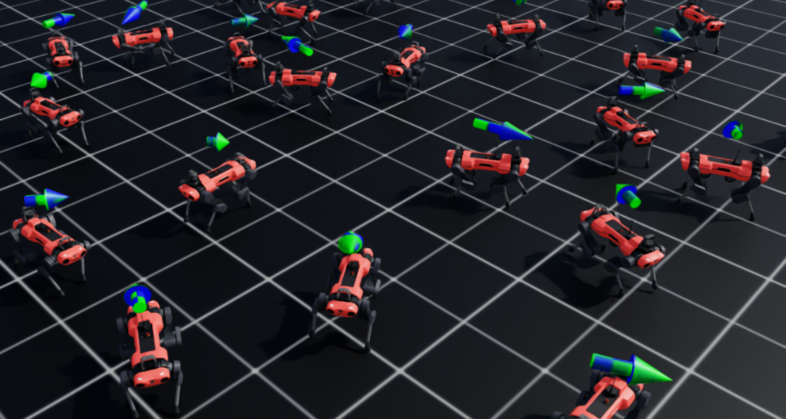

---
# QUADRRL

## Overview

Quadrrl builds on NVIDIA Isaac Lab to research and prototype deep reinforcement learning for quadruped robots.
It includes locomotion and navigation tasks across flat and rough terrains, covering velocity tracking,
goal-directed navigation, and multi-agent coordination.

**Highlights**
- Unified training suite for ANYmal-C, ANYmal-D, Spot, and Unitree Go2 robots
- Direct and manager-based task variants for locomotion and navigation
- Ready-to-run configs for `rl_games`, `rsl_rl`, `skrl`, and `harl` RL frameworks
- Multi-agent reinforcement learning (MARL) support for cooperative tasks
- Optional Omniverse UI extension for quick visualization and debugging

## 📋 Prerequisites

### Compute Requirements
- **GPU**: NVIDIA GPU with CUDA support (RTX 3060 or better recommended)
- **CPU**: Multi-core processor (8+ cores recommended for large batches)
- **RAM**: 16 GB minimum, 32 GB recommended
- **Storage**: 20 GB+ free space for Isaac Lab and generated logs

### Software Requirements
- **OS**: Linux (Ubuntu 20.04+) or Windows 10/11 (64-bit)
- **Isaac Lab**: Installed per the [official guide](https://isaac-sim.github.io/IsaacLab/main/source/setup/installation/index.html)
- **Python**: 3.10 or newer (conda, uv, or virtualenv)
- **CUDA**: Match the version required by your Isaac Lab build
- **Git**: For cloning this repository
- Optional: Omniverse Kit / Isaac Sim for UI workflows

## 📦 Installation

```bash
# Clone the repository
git clone https://github.com/lbnmahs/quadrrl.git
cd quadrrl

# Activate the Python environment that already has Isaac Lab dependencies
conda activate isaaclab    # or `source isaaclab.sh -p` depending on your setup

# Install Quadrrl in editable mode
python -m pip install -e source/quadrrl

# (Optional) install developer tooling
pip install pre-commit
pre-commit install
```

## 🚀 Running Quadrrl

### Discover Tasks

```bash
python scripts/list_envs.py
```
### Single-Agent Tasks

| S. No. | Task Name                                           | Environment File                    | Config File                          |
|-------:|-----------------------------------------------------|-------------------------------------|--------------------------------------|
| 1      | Template-Quadrrl-Velocity-Flat-Anymal-C-Direct-v0   | `anymal_c_env.py`                   | `anymal_c_env_cfg.py`                |
| 2      | Template-Quadrrl-Velocity-Rough-Anymal-C-Direct-v0  | `anymal_c_env.py`                   | `anymal_c_env_cfg.py`                |
| 3      | Template-Quadrrl-Velocity-Flat-Anymal-C-v0          | `ManagerBasedRLEnv`                 | `flat_env_cfg.py`                    |
| 4      | Template-Quadrrl-Velocity-Flat-Anymal-C-Play-v0     | `ManagerBasedRLEnv`                 | `flat_env_cfg.py`                    |
| 5      | Template-Quadrrl-Velocity-Rough-Anymal-C-v0         | `ManagerBasedRLEnv`                 | `rough_env_cfg.py`                   |
| 6      | Template-Quadrrl-Velocity-Rough-Anymal-C-Play-v0    | `ManagerBasedRLEnv`                 | `rough_env_cfg.py`                   |
| 7      | Template-Quadrrl-Velocity-Flat-Anymal-D-v0          | `ManagerBasedRLEnv`                 | `flat_env_cfg.py`                    |
| 8      | Template-Quadrrl-Velocity-Flat-Anymal-D-Play-v0     | `ManagerBasedRLEnv`                 | `flat_env_cfg.py`                    |
| 9      | Template-Quadrrl-Velocity-Rough-Anymal-D-v0         | `ManagerBasedRLEnv`                 | `rough_env_cfg.py`                   |
| 10     | Template-Quadrrl-Velocity-Rough-Anymal-D-Play-v0    | `ManagerBasedRLEnv`                 | `rough_env_cfg.py`                   |
| 11     | Template-Quadrrl-Velocity-Flat-Unitree-Go2-v0       | `ManagerBasedRLEnv`                 | `flat_env_cfg.py`                    |
| 12     | Template-Quadrrl-Velocity-Flat-Unitree-Go2-Play-v0  | `ManagerBasedRLEnv`                 | `flat_env_cfg.py`                    |
| 13     | Template-Quadrrl-Velocity-Rough-Unitree-Go2-v0      | `ManagerBasedRLEnv`                 | `rough_env_cfg.py`                   |
| 14     | Template-Quadrrl-Velocity-Rough-Unitree-Go2-Play-v0 | `ManagerBasedRLEnv`                 | `rough_env_cfg.py`                   |
| 15     | Template-Quadrrl-Navigation-Flat-Anymal-C-v0        | `ManagerBasedRLEnv`                 | `navigation_env_cfg.py`              |
| 16     | Template-Quadrrl-Navigation-Flat-Anymal-C-Play-v0   | `ManagerBasedRLEnv`                 | `navigation_env_cfg.py`              |

### Multi-Agent Tasks

| S. No. | Task Name                                           | Environment File                    | Config File                          | RL Framework |
|-------:|-----------------------------------------------------|-------------------------------------|--------------------------------------|-------------|
| 17     | Template-Quadrrl-MARL-Direct-Anymal-C-v0           | `anymal_c_marl_env.py`              | `anymal_c_marl_env_cfg.py`           | HARL        |
| 18     | Template-Quadrrl-Velocity-Flat-Spot-MARL-v0        | `ManagerBasedMARLEnv`               | `spot_marl_cfg.py`                   | RSL-RL, SKRL, HARL |
| 19     | Template-Quadrrl-Velocity-Flat-Spot-MARL-Play-v0  | `ManagerBasedMARLEnv`               | `spot_marl_cfg.py`                   | RSL-RL, SKRL, HARL |

**Note:**
- Task 17: Direct MARL task with two ANYmal-C robots cooperatively carrying a bar to target locations (HARL only).
- Tasks 18-19: Manager-based MARL task with Spot robot using 4 agents (one per leg) for velocity tracking on flat terrain. Supports RSL-RL, SKRL, and HARL frameworks.
**Note:**  Update `scripts/list_envs.py` if you rename any tasks so that they continue to show up in listings.

### Train Policies

Replace `<RL_LIBRARY>` with `rl_games`, `rsl_rl`, `skrl`, or `harl`, and supply any extra training flags.

**Single-Agent Tasks:**
```bash
python scripts/<RL_LIBRARY>/train.py --task=<TASK_NAME> --num_envs=4096 --seed=42
```

**Multi-Agent Tasks:**

*ANYmal-C Bar Carrying:*
```bash
python scripts/harl/train.py --task=Template-Quadrrl-MARL-Direct-Anymal-C-v0 --num_envs=4096 --algorithm=happo --headless
```

*Spot Velocity Tracking:*
```bash
# Using HARL
python scripts/harl/train.py --task=Template-Quadrrl-Velocity-Flat-Spot-MARL-v0 --num_envs=4096 --algorithm=happo --headless

# Using RSL-RL
python scripts/rsl_rl/train.py --task=Template-Quadrrl-Velocity-Flat-Spot-MARL-v0 --num_envs=4096

# Using SKRL
python scripts/skrl/train.py --task=Template-Quadrrl-Velocity-Flat-Spot-MARL-v0 --num_envs=4096
```

### Evaluate Saved Policies

**Single-Agent Play Mode:**
Play-mode tasks (suffix `-Play`) load evaluation checkpoints and curriculum settings.

```bash
python scripts/<RL_LIBRARY>/play.py --task=<TASK_NAME>-Play --checkpoint=/absolute/path/to/checkpoint.pth
```

**Multi-Agent Play Mode:**

*ANYmal-C Bar Carrying:*
```bash
python scripts/harl/play.py --task=Template-Quadrrl-MARL-Direct-Anymal-C-v0 --num_envs=5 --dir=/path/to/logs/harl/anymal_c_marl/EXPERIMENT_NAME
```

*Spot Velocity Tracking:*
```bash
# Using HARL
python scripts/harl/play.py --task=Template-Quadrrl-Velocity-Flat-Spot-MARL-Play-v0 --num_envs=5 --dir=/path/to/logs/harl/spot_marl/EXPERIMENT_NAME

# Using RSL-RL
python scripts/rsl_rl/play.py --task=Template-Quadrrl-Velocity-Flat-Spot-MARL-Play-v0 --checkpoint=/path/to/checkpoint.pth

# Using SKRL
python scripts/skrl/play.py --task=Template-Quadrrl-Velocity-Flat-Spot-MARL-Play-v0 --checkpoint=/path/to/checkpoint.pth
```

### Demo Scripts

Run example demonstrations and visualizations:

```bash
# Quadruped examples demo
python scripts/demos/quadrupeds.py

# USD policy inference
python scripts/demos/usd_policy_inference.py

# Interactive locomotion demos for specific robots
python scripts/demos/il_anymal_d_usd.py
python scripts/demos/il_go2_rough.py
```

Tip: Use `isaaclab.sh -p` or `isaaclab.bat -p` in place of `python` if Isaac Lab is not installed in the active Python environment.


## 📂 Project Layout

- `source/quadrrl/quadrrl/robots` – robot asset wrappers (ANYmal variants, Spot, and Unitree Go2).
- `source/quadrrl/quadrrl/tasks/direct` – low-level Isaac Gym–style environments and multi-agent setups with RL configs.
- `source/quadrrl/quadrrl/tasks/manager_based` – manager-based tasks with locomotion and navigation curricula, rewards, and symmetry helpers.
- `source/quadrrl/scripts` – entry points for training, evaluation, and diagnostic agents for supported RL frameworks.
  - `scripts/rl_games/` – RL Games framework integration
  - `scripts/rsl_rl/` – RSL-RL framework integration
  - `scripts/skrl/` – SKRL framework integration
  - `scripts/harl/` – HARL framework integration (multi-agent RL)
  - `scripts/demos/` – demonstration and visualization scripts

Refer to `scripts/demos/quadrupeds.py` for additional guidance on composing task configurations programmatically.

## 🤖 Multi-Agent Reinforcement Learning

Quadrrl includes support for multi-agent reinforcement learning (MARL) with two distinct task types:

1. **Direct MARL**: Cooperative bar-carrying task with two ANYmal-C robots
2. **Manager-Based MARL**: Velocity tracking task with Spot robot using 4 leg agents

### Setup HARL

HARL is included as a submodule in `scripts/harl/HARL/`. The framework has been customized for Isaac Lab integration and only includes code necessary for Isaac Lab environments.

### Training Multi-Agent Policies

**ANYmal-C Bar Carrying Task:**

```bash
# Train with HAPPO (default)
python scripts/harl/train.py \
    --task=Template-Quadrrl-MARL-Direct-Anymal-C-v0 \
    --num_envs=4096 \
    --algorithm=happo \
    --headless

# Train with other algorithms
python scripts/harl/train.py \
    --task=Template-Quadrrl-MARL-Direct-Anymal-C-v0 \
    --num_envs=4096 \
    --algorithm=mappo \
    --headless
```

**Spot Velocity Tracking Task:**

```bash
# Using HARL
python scripts/harl/train.py \
    --task=Template-Quadrrl-Velocity-Flat-Spot-MARL-v0 \
    --num_envs=4096 \
    --algorithm=happo \
    --headless

# Using RSL-RL
python scripts/rsl_rl/train.py \
    --task=Template-Quadrrl-Velocity-Flat-Spot-MARL-v0 \
    --num_envs=4096

# Using SKRL
python scripts/skrl/train.py \
    --task=Template-Quadrrl-Velocity-Flat-Spot-MARL-v0 \
    --num_envs=4096
```

**HARL Supported Algorithms:**
- `happo` – Hierarchical Actor-Critic PPO (default)
- `hatrpo` – Hierarchical Actor-Critic TRPO
- `haa2c` – Hierarchical Actor-Critic A2C
- `mappo` – Multi-Agent PPO
- `maddpg` – Multi-Agent DDPG
- `matd3` – Multi-Agent TD3
- `hasac` – Hierarchical Actor-Critic SAC
- `hatd3` – Hierarchical Actor-Critic TD3
- `had3qn` – Hierarchical Actor-Critic D3QN
- `haddpg` – Hierarchical Actor-Critic DDPG

### Evaluating Multi-Agent Policies

**ANYmal-C Bar Carrying:**
```bash
python scripts/harl/play.py \
    --task=Template-Quadrrl-MARL-Direct-Anymal-C-v0 \
    --num_envs=5 \
    --dir=/path/to/logs/harl/anymal_c_marl/EXPERIMENT_NAME
```

**Spot Velocity Tracking:**
```bash
# Using HARL
python scripts/harl/play.py \
    --task=Template-Quadrrl-Velocity-Flat-Spot-MARL-Play-v0 \
    --num_envs=5 \
    --dir=/path/to/logs/harl/spot_marl/EXPERIMENT_NAME

# Using RSL-RL
python scripts/rsl_rl/play.py \
    --task=Template-Quadrrl-Velocity-Flat-Spot-MARL-Play-v0 \
    --checkpoint=/path/to/checkpoint.pth

# Using SKRL
python scripts/skrl/play.py \
    --task=Template-Quadrrl-Velocity-Flat-Spot-MARL-Play-v0 \
    --checkpoint=/path/to/checkpoint.pth
```

### Multi-Agent Task Details

**Template-Quadrrl-MARL-Direct-Anymal-C-v0** (Direct MARL):
- **Agents**: Two ANYmal-C robots
- **Objective**: Cooperatively carry a bar to randomly sampled target locations
- **Observations**: Robot state, joint positions/velocities, target position relative to bar
- **Actions**: Joint position commands (12 DoF per robot)
- **Rewards**: Target distance (primary), target reached bonus, velocity tracking (smoothness)
- **Termination**: Robot falls, bar falls/tilts, or episode timeout
- **Framework**: HARL only

**Template-Quadrrl-Velocity-Flat-Spot-MARL-v0** (Manager-Based MARL):
- **Agents**: Four agents (agentFR, agentFL, agentHR, agentHL) - one per leg
- **Objective**: Velocity tracking on flat terrain
- **Observations**: Base velocity, angular velocity, projected gravity, velocity commands, joint positions/velocities (own leg + other legs), previous actions
- **Actions**: Joint position commands per leg (3 DoF per leg)
- **Rewards**: Velocity tracking, joint regulation, action rate, and other locomotion rewards
- **Termination**: Robot falls or episode timeout
- **Frameworks**: RSL-RL, SKRL, HARL

## 🤝 Contributing

- Fork the repository, create feature branches, and open pull requests with clear descriptions.
- Run `pre-commit run --all-files` before submitting changes.
- Add tests or evaluation scripts when introducing new environments or reward structures.
- Update this README and `docs/CHANGELOG.rst` when you add new tasks or major capabilities.

## 📚 Resources & Inspiration

- NVIDIA Isaac Lab Documentation – <https://isaac-sim.github.io/IsaacLab/>
- Quadrrl training examples in `scripts/quadrupeds.py`
- HARL Framework - https://github.com/PKU-MARL/HARL

