# QUADRRL

[](https://docs.omniverse.nvidia.com/isaacsim/latest/overview.html)
[](https://isaac-sim.github.io/IsaacLab)
[](https://docs.python.org/3/whatsnew/3.11.html)
[](https://releases.ubuntu.com/22.04/)
[](https://www.microsoft.com/en-us/)
[](https://pre-commit.com/)
[](https://opensource.org/license/bsd-3-clause)

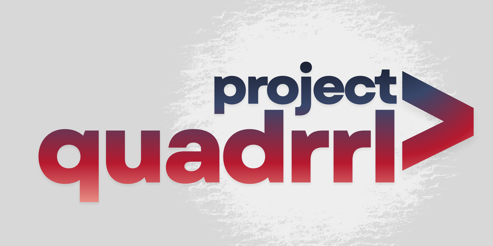

## Overview

Quadrrl builds on NVIDIA Isaac Lab to research and prototype deep reinforcement learning for quadruped robots. It includes locomotion and navigation tasks across flat and rough terrains, covering velocity tracking, goal-directed navigation, and multi-agent coordination.

**Highlights**
- Unified training suite for legged quadrupeds (ANYmal-C/D, Spot, Unitree Go2, B2, Lite3, ZSL1) and wheeled-legged robots (Go2W, B2W, ZSL1W, M20)
- Direct and manager-based task variants for locomotion and navigation
- Velocity configs organized by `config/quadrupeds/` (legged) and `config/wheeled/` (wheeled-legged)
- Ready-to-run configs for `rl_games`, `rsl_rl`, `skrl`, and `harl` RL frameworks
- Multi-agent reinforcement learning (MARL) support for cooperative tasks
- Spot uses a tailored reward structure (gait shaping, foot clearance, air-time balancing) that differs from generic locomotion rewards, enabling richer gait coordination experiments

## 📚 Documentation

- **[Installation Guide](docs/INSTALLATION.md)** - Setup instructions
- **[Getting Started](docs/GETTING_STARTED.md)** - Quick start guide
- **[Simulation Videos](docs/DEMOS.md)** - Video demonstrations
- **[Project Structure](docs/STRUCTURE.md)** - Code organization
- **[Training Guide](docs/TRAINING.md)** - Single-agent and multi-agent RL training
- **[Scripts Documentation](scripts/README.md)** - Available scripts and utilities
- **[Tasks Documentation](source/quadrrl/quadrrl/tasks/README.md)** - Task architecture

## 📋 Prerequisites

- **GPU**: NVIDIA GPU with CUDA support (RTX 3060 or better recommended)
- **CPU**: Multi-core processor (8+ cores recommended)
- **RAM**: 16 GB minimum, 32 GB recommended
- **OS**: Linux (Ubuntu 20.04+) or Windows 10/11 (64-bit)
- **Isaac Lab**: Installed per [official guide](https://isaac-sim.github.io/IsaacLab/main/source/setup/installation/index.html)
- **Python**: 3.10 or newer

## 🚀 Quick Start

```bash
git clone https://github.com/lbnmahs/quadrrl.git
cd quadrrl
conda activate isaaclab
python -m pip install -e source/quadrrl
python scripts/list_envs.py
python scripts/reinforcement_learning/rsl_rl/train.py \
    --task=Template-Quadrrl-Velocity-Flat-Anymal-C-v0 \
    --num_envs=4096
```

See [Installation Guide](docs/INSTALLATION.md) and [Getting Started Guide](docs/GETTING_STARTED.md) for details.

## 🤖 Supported Robots

| Category   | Robot Model         | Environment Name | Image |
|------------|---------------------|------------------------|-------|
| **Quadruped** | [Anymal C](https://www.anybotics.com/robotics/anymal) | `Template-Quadrrl-Velocity-Rough-Anymal-C-v0` | 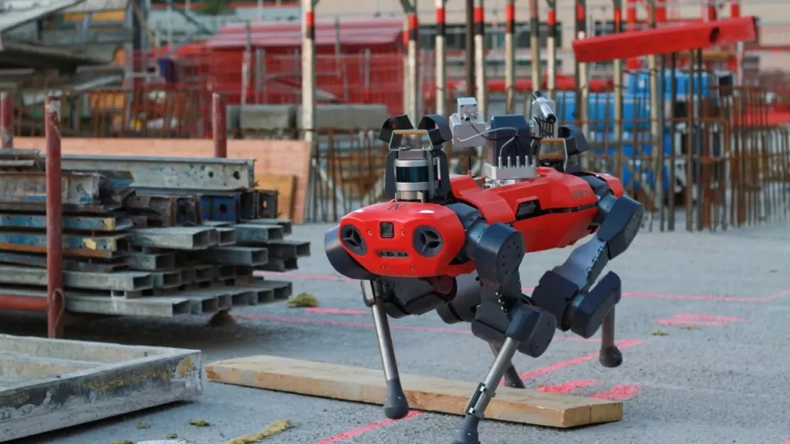 |
|            | [Anymal D](https://www.anybotics.com/robotics/anymal) | `Template-Quadrrl-Velocity-Rough-Anymal-D-v0` | 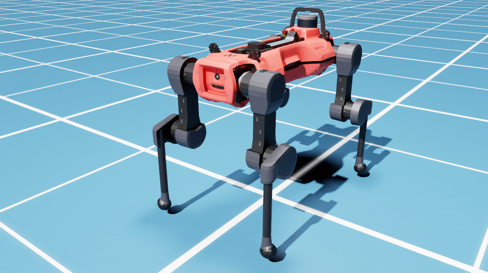 |
|            | [Boston Dynamics Spot](https://bostondynamics.com/products/spot/) | `Template-Quadrrl-Velocity-Rough-Spot-v0` | 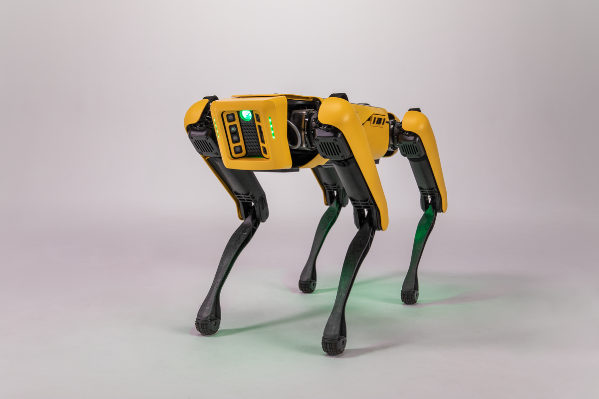 |
|            | [Unitree Go2](https://www.unitree.com/go2) | `Template-Quadrrl-Velocity-Rough-Unitree-Go2-v0` | 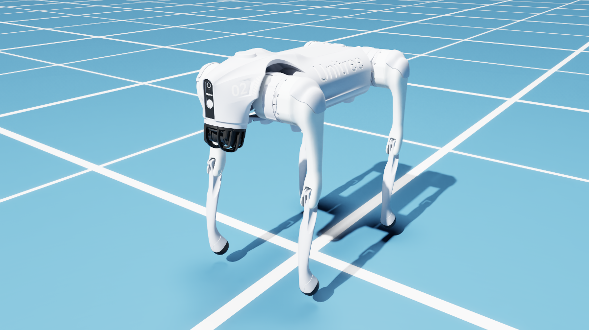 |
|            | [Unitree B2](https://www.unitree.com/b2) | `Template-Quadrrl-Velocity-Rough-Unitree-B2-v0` | 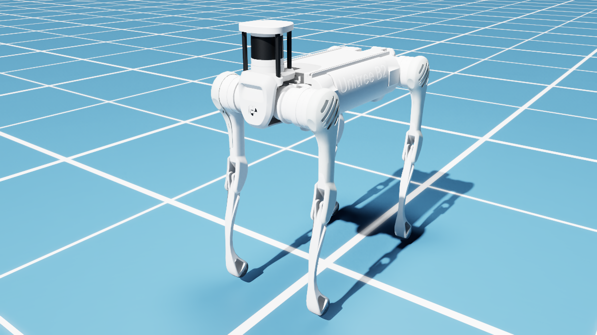 |
|            | [Deeprobotics Lite3](https://www.deeprobotics.cn/robot/index/product1.html) | `Template-Quadrrl-Velocity-Rough-Deeprobotics-Lite3-v0` | 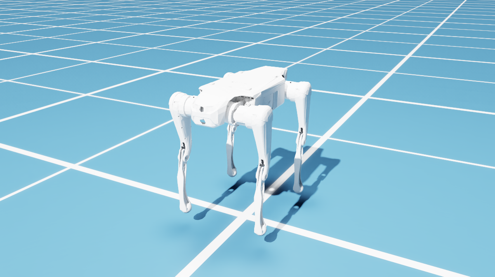 |
|            | [Zsibot ZSL1](https://www.zsibot.com/zsl1) | `Template-Quadrrl-Velocity-Rough-Zsibot-ZSL1-v0` | 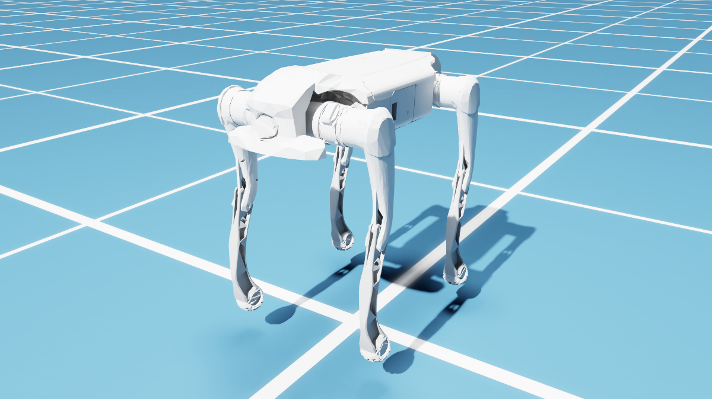 |
| **Wheeled** | [Unitree Go2W](https://www.unitree.com/go2-w) | `Template-Quadrrl-Velocity-Rough-Unitree-Go2W-v0` | 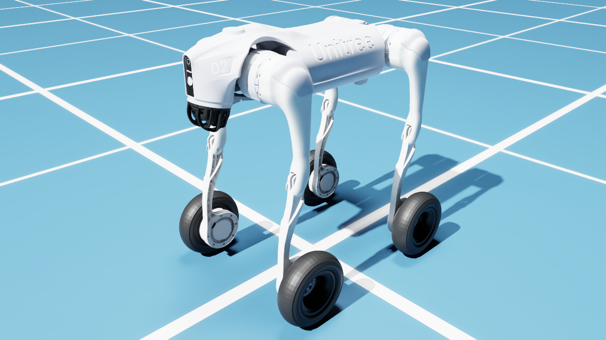 |
|            | [Unitree B2W](https://www.unitree.com/b2-w) | `Template-Quadrrl-Velocity-Rough-Unitree-B2W-v0` | 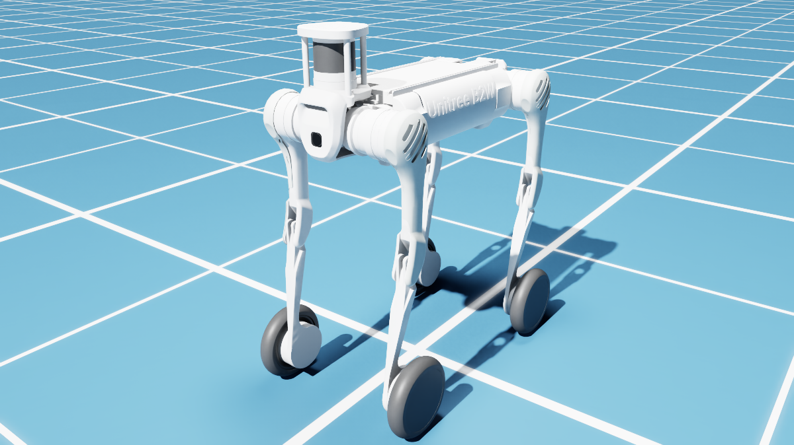 |
|            | [Deeprobotics M20](https://www.deeprobotics.cn/robot/index/lynx.html) | `Template-Quadrrl-Velocity-Rough-Deeprobotics-M20-v0` | 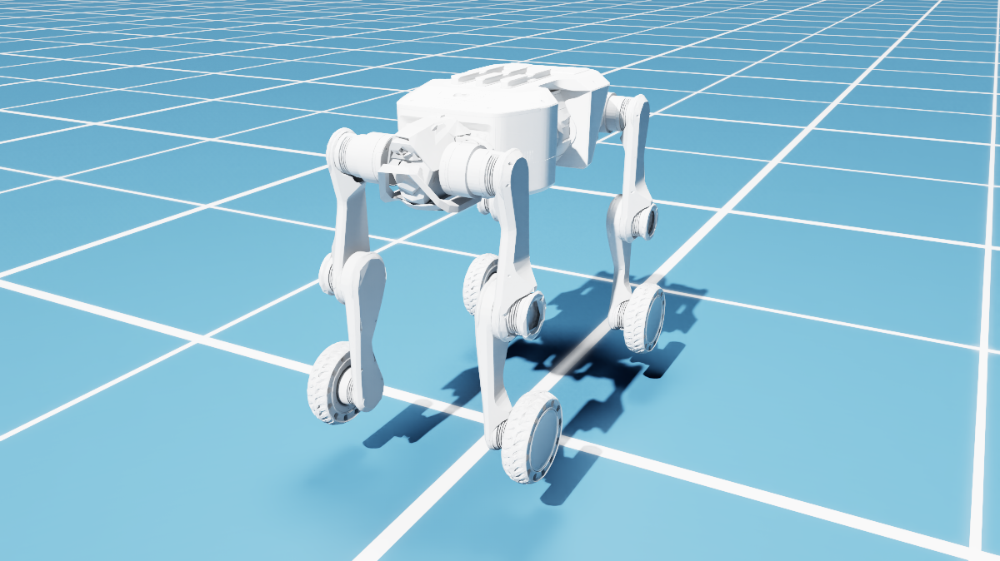 |
|            | [Zsibot ZSL1W](https://www.zsibot.com/zsl1) | `Template-Quadrrl-Velocity-Rough-ZSIBot-ZSL1W-v0` | 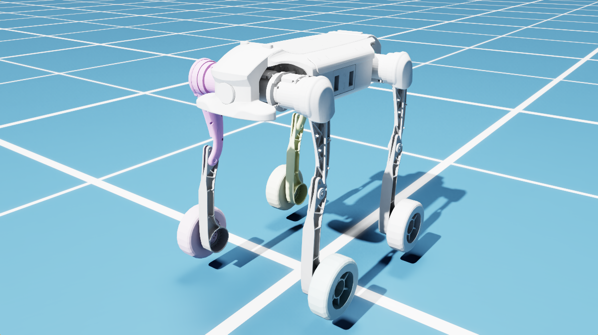 |

## 🔧 RL Frameworks

- **RSL-RL** - Default framework with PPO support
- **RL Games** - NVIDIA's RL framework
- **SKRL** - Scikit-learn compatible RL library
- **HARL** - Multi-agent RL framework (customized for Isaac Lab)

## 🤝 Contributing

We welcome contributions! Please see [CONTRIBUTING.md](CONTRIBUTING.md) for guidelines on how to contribute to Quadrrl.

- Fork the repository, create feature branches, and open pull requests with clear descriptions.
- Run `pre-commit run --all-files` before submitting changes.
- Add tests or evaluation scripts when introducing new environments or reward structures.
- Update documentation when you add new tasks or major capabilities.

## 📖 Citation

If you use Quadrrl in your research, please cite:

```bibtex
@software{quadrrl2026,
  title={Quadrrl: Isaac Lab-Based Multi-Quadruped Locomotion Training and Performance Evaluation Suite},
  author={Mahihu, Laban Njoroge},
  year={2026},
  url={https://github.com/lbnmahs/quadrrl}
}
```

## 📄 License

This project is licensed under the BSD-3-Clause License - see the [LICENSE](LICENSE) file for details.

## 🙏 Acknowledgments

Special thanks to Dr. Manal Helal for her guidance and advice. See [ACKNOWLEDGMENTS.md](ACKNOWLEDGMENTS.md) for a complete list of acknowledgments.

## 📚 Resources & Inspiration

- [NVIDIA Isaac Lab Documentation](https://isaac-sim.github.io/IsaacLab/)
- [HARL Framework](https://github.com/PKU-MARL/HARL)